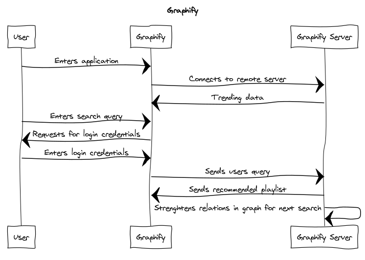
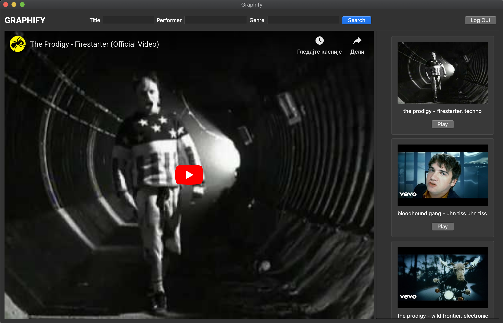

# graphify

Project includes server and client application. <br>
Main functionality is streaming service with recommendation system based on KnowledgeGraph.

### Client
Client side is desktop application which retrieves trending, recommended videos and particular searched song.<br>
As some of owners have forbidden certain videos being streamed from youtube, some of the songs cannot be played in client application. <br> 
Three search parameters are included:
* Performer
* Song title
* Genre <br>
As well as the different combinations of those three.

### Server

Server application is responsible for handling requests, generating recommended songs based on users' past searches as well as the searches of users who likes similar music. <br>
All data used for generating KnowledgeGraph, which is the engine behind recommendation system, is gathered from WikiData API.

### Usage

Usage of client application is pretty simplified, and the workflow is described bellow.



#### Current user interface: <br>


### Build and run

Project is written in Qt framework, so one of the ways to build and run is to open Server or Client app from QtCreator and run it. <br>
For unix based systems, shell script is available:<br>
```
git clone https://github.com/MATF-RS20/RS020-graphify.git
cd RS020-graphify/
sudo chmod +x start.sh
./start.sh (Client | Server)
```
**Prerequisites**: qmake, make
### Team:
[Dimitrije Antic](https://github.com/antic11d) 128/2016<br>
[Andrija Novakovic](https://github.com/akinovak) 68/2016<br>
[Nikola Stanojevic](https://github.com/StanojevicNikola) 92/2016
